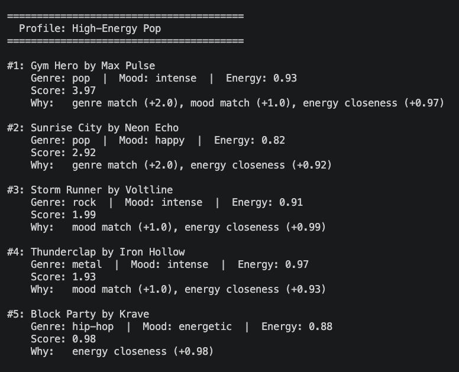
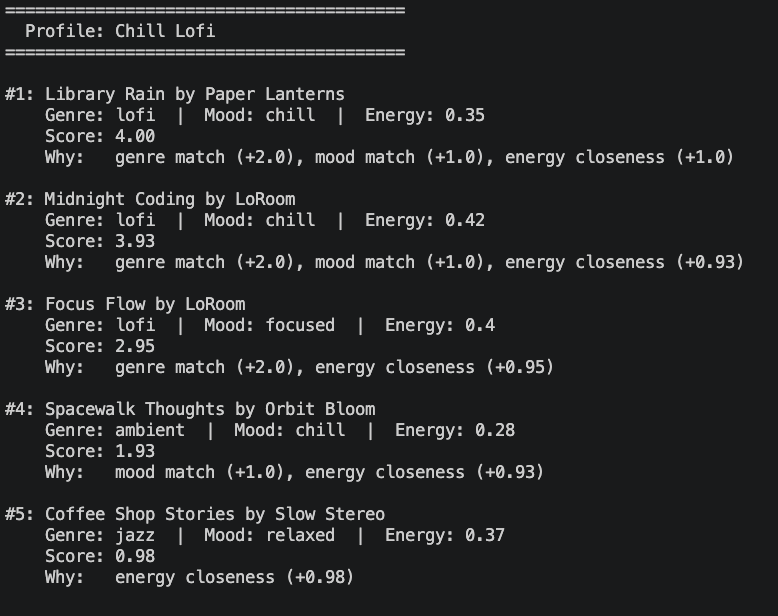

# 🎵 Music Recommender Simulation

## Project Summary

In this project you will build and explain a small music recommender system.

Your goal is to:

- Represent songs and a user "taste profile" as data
- Design a scoring rule that turns that data into recommendations
- Evaluate what your system gets right and wrong
- Reflect on how this mirrors real world AI recommenders

The goal of this project is to build a small music recommender that scores songs against a user's taste profile (genre, mood, energy) and returns the best matches — then reflect on what the system gets right, what it gets wrong, and how that mirrors real-world AI recommenders like Spotify.

---

## How The System Works

Explain your design in plain language.

Some prompts to answer:

- What features does each `Song` use in your system
  - For example: genre, mood, energy, tempo
- What information does your `UserProfile` store
- How does your `Recommender` compute a score for each song
- How do you choose which songs to recommend

You can include a simple diagram or bullet list if helpful.

-> Some feautures that each song uses my system will include genre, tempo, energy, mood, danceability, duration, speechiness ->  music:singing ratio, and valence. 
-> Some information that my UserProfile will store include favorite genre, target energy, current mood, and listening history, 
-> My recommender will compute a score of each song depending on the weights for the different categories. For example, genre, mood, and energy would the highest weights since users rarely tend to deviate from this depending on each circumstance. Danceabiliy, duration, valence, and speechiness will be lower weights since most people may not care as much about these additional features. Preferred features will be weighted higher, thus computing a higher score for these types of songs. 
-> I would choose which songs to recommend depending on the score for every song and return the highest value. This highest value will be the score/song closest to the user's tastes. 


## Alogorithm Recipe: 
--> The recommend scores every song against the user's preferences and returns the top k. The inner score functions assigns: 
  - Genre matches favorite_genre: +2.0 
  - Mood matches favorite_mood: +1.0 
  - Energy closeness to target_energy: +0.0 - 1.0 

The smaller the gap from target energy, the higher the bonus. All the songs are sorted by score descending and the first k songs are returned. 

## Potential Biases: 
--> Genre Bias: Since genre carries double the weight of mood (2:1), it might be biased toward genre. Even if a song matches a user's mood and energy, it may not be stated as a good match. 
--> Genre Bias: No genre has both moods. No rock song can be "happy" so for genre + mood combo, system cannot score above 2.0. 





---

## Getting Started

### Setup

1. Create a virtual environment (optional but recommended):

   ```bash
   python -m venv .venv
   source .venv/bin/activate      # Mac or Linux
   .venv\Scripts\activate         # Windows

2. Install dependencies

```bash
pip install -r requirements.txt
```

3. Run the app:

```bash
python -m src.main
```

### Running Tests

Run the starter tests with:

```bash
pytest
```

You can add more tests in `tests/test_recommender.py`.

---

## Experiments You Tried

Use this section to document the experiments you ran. For example:

- What happened when you changed the weight on genre from 2.0 to 0.5
- What happened when you added tempo or valence to the score
- How did your system behave for different types of users

I changed the genre bonus from +2.0 to +1.0 and made energy worth up to +2.0 instead of +1.0. Two broken profiles fixed themselves. Profiles that were already working didn't change at all. This tells me the original genre weight is probably too high.

A user who wanted sad but high-energy — the system recommended quiet sad songs because genre+mood outweighed the energy gap. The output felt wrong.
A user with a genre not in the catalog (k-pop) — the genre bonus never fired, so the system quietly fell back to mood+energy only. It still returned reasonable songs, but the user would have no idea why.
A user wanting classical + energetic (a combo that doesn't exist in the catalog) — the system recommended a sad classical song. Genre matched, mood did not.


---

## Limitations and Risks

Summarize some limitations of your recommender.

Examples:

- It only works on a tiny catalog
- It does not understand lyrics or language
- It might over favor one genre or mood

You will go deeper on this in your model card.

- Only 19 songs — thin catalog, especially for rare genres
- Genre weight (+2.0) drowns out mood and energy
- No partial credit — `"indie pop"` ≠ `"pop"`, `"intense"` ≠ `"energetic"`
- `likes_acoustic` is stored but never used in scoring
- Same profile always returns the same top 5 — no variety
- Silently degrades when a genre isn't in the catalog


---

## Reflection

Read and complete `model_card.md`:

[**Model Card**](model_card.md)

Write 1 to 2 paragraphs here about what you learned:

- about how recommenders turn data into predictions
- about where bias or unfairness could show up in systems like this

A recommender doesn't understand music — it just compares numbers and labels, then returns the highest score. The weights I chose (like genre being worth double mood) are subjective decisions, not facts, so changing them changes the results. What surprised me most is how bias shows up quietly — likes_acoustic is stored but never used, rare moods get buried, and a missing genre silently degrades the output with no warning. Real systems like Spotify have the same problems, just at a much larger scale.

---

## 7. `model_card_template.md`

Combines reflection and model card framing from the Module 3 guidance. :contentReference[oaicite:2]{index=2}  

```markdown
# 🎧 Model Card - Music Recommender Simulation

## 1. Model Name

Give your recommender a name, for example:

> MusicMatcher2.0

---

## 2. Intended Use

- What is this system trying to do
- Who is it for

Example:

> This system scores songs against a user's preferred genre, mood, and energy level, then returns the top matches as recommendations. It is for a classroom simulation — not real users — to explore how AI recommenders make decisions.

---

## 3. How It Works (Short Explanation)

Describe your scoring logic in plain language.

- What features of each song does it consider
- What information about the user does it use
- How does it turn those into a number

Each song is given a score based on three things: whether the genre matches the user's favorite (+2 points), whether the mood matches (+1 point), and how close the song's energy level is to what the user wants (up to +1 point). The song with the highest total score gets recommended first. It's like a checklist — the more boxes a song checks, the higher it ranks.

---

## 4. Data

Describe your dataset.

- How many songs are in `data/songs.csv`
- Did you add or remove any songs
- What kinds of genres or moods are represented
- Whose taste does this data mostly reflect

The catalog has 19 songs. I kept the original 10 and added 9 more to cover a wider range of genres and moods. It includes genres like lofi, pop, rock, hip-hop, classical, jazz, r&b, metal, and electronic, with moods ranging from chill and happy to intense, sad, and romantic. The data mostly reflects a Western, English-language taste — genres like K-pop, Latin, or Afrobeats are not represented at all.

---

## 5. Strengths

Where does your recommender work well

You can think about:
- Situations where the top results "felt right"
- Particular user profiles it served well
- Simplicity or transparency benefits

It works best when a user's genre, mood, and energy all have good matches in the catalog. The Chill Lofi profile hit a perfect score of 4.0 — the top result matched on every single signal. It's also easy to understand: every recommendation comes with a clear "Why" explanation showing exactly which signals fired, so there are no mystery results.

---

## 6. Limitations and Bias

Where does your recommender struggle

Some prompts:
- Does it ignore some genres or moods
- Does it treat all users as if they have the same taste shape
- Is it biased toward high energy or one genre by default
- How could this be unfair if used in a real product

It struggles when a user's preferred genre has few songs in the catalog, or when their genre and mood don't exist together in any song. The genre bonus is so strong that it can override mood entirely — recommending a sad song to someone who asked for energetic music, just because the genre matched. If used in a real product, users with niche tastes would consistently get worse recommendations than users who fit the most common genres, with no explanation why.

---

## 7. Evaluation

How did you check your system

Examples:
- You tried multiple user profiles and wrote down whether the results matched your expectations
- You compared your simulation to what a real app like Spotify or YouTube tends to recommend
- You wrote tests for your scoring logic

You do not need a numeric metric, but if you used one, explain what it measures.

I tested 7 profiles — 3 normal and 4  edge cases designed to break the system. For each one I checked whether the #1 result actually matched what the user asked for. I also ran a weight-shift experiment, halving the genre bonus and doubling the energy bonus, then compared the before and after rankings. Two broken profiles fixed themselves, which confirmed the genre weight was too high.

---

## 8. Future Work

If you had more time, how would you improve this recommender

Examples:

- Add support for multiple users and "group vibe" recommendations
- Balance diversity of songs instead of always picking the closest match
- Use more features, like tempo ranges or lyric themes

Add more songs so rare genres have real competition
Add some variety so the same profile doesn't always return the exact same 5 songs
Factor in tempo and valence, which are already in the data but unused

---

## 9. Personal Reflection

A few sentences about what you learned:

- What surprised you about how your system behaved
- How did building this change how you think about real music recommenders
- Where do you think human judgment still matters, even if the model seems "smart"

What surprised me most was how confidently the system recommended the wrong song — it would return a sad, quiet track to someone who asked for energetic music, with a high score and a clean explanation, as
